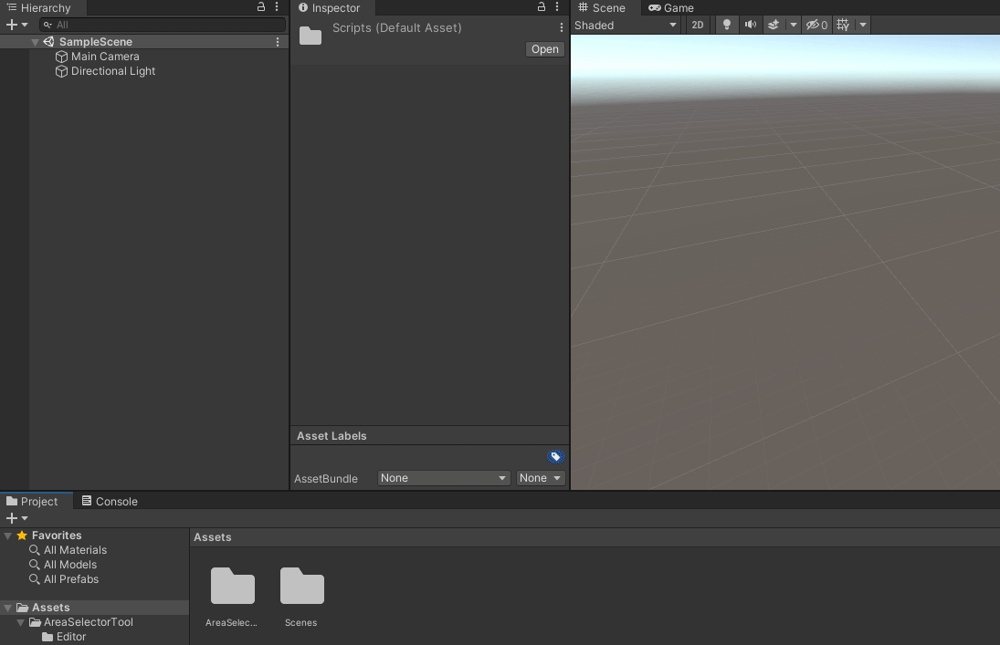
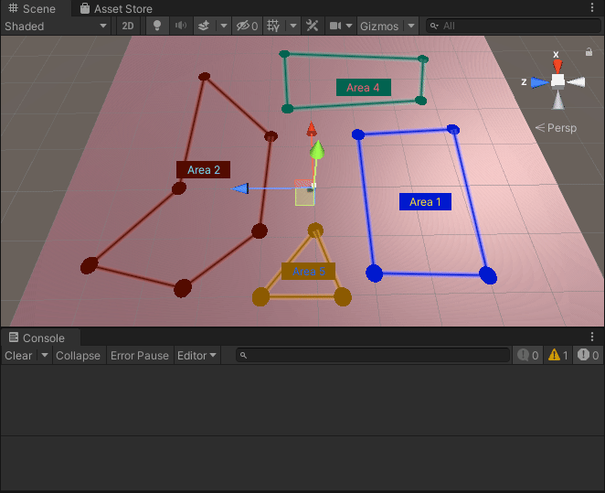

# UnityAreaTool
A simple tool for defining areas in the Unity Editor

## How to install
Simply download the Unity Asset "UnityAreaTool.asset" from the release section. Then in your current project or a new one, import the asset.

## How to setup
Create a new gameobject and add the AreaTool script.



## How to use
You can click to add new points to the area you are currently editing. To create a new area, simply hold SHIFT and click the left mouse button. To delete a point, SHIFT-click the desired point to delete. Furthermore, you can customize each area with a name, a tag and a color.

## Usage example
The script AreaExtensions contains two methods:
```
public static bool IsPositionWithinArea(this Area area, Vector3 position) { ... }
public static bool IsPositionWithinAreaWithTag(string tag, Vector3 position) { ... }
```
You can use these methods to trigger certain events on entering or leaving an area. See the example scene for such a usage


